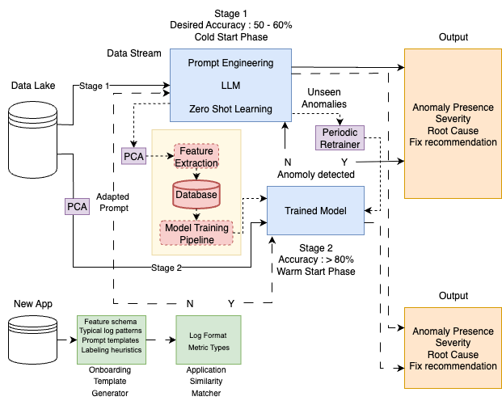

# Log Anomaly Detection POC — LLM (Gemini) + IsolationForest

A two-stage proof-of-concept to detect anomalies in application logs:

1) **Stage 1 (Cold Start):** Batch logs → prompt **Gemini** to label anomalies and return JSON.  
2) **Stage 2 (Warm Start):** Train **IsolationForest** on LLM-labeled normal logs and run scalable anomaly detection.  
Includes **new-app onboarding** (schema detection/mapping), **compatibility checks**, and **PSI drift** on numeric features.

<p align="center">
  
</p>

---

## Features

- Synthetic log generator with realistic fields (service, instance, queue, level, status, message, errors).
- Windowing to send **groups of logs** to Gemini (free-tier friendly).
- LLM labeling with per-(service, instance) thresholds or auto-threshold mode.
- JSON parsing with Markdown-fence stripping → **`df_labeled`** (training data).
- LLM accuracy metrics (TP/TN/FP/FN, Accuracy/Precision/Recall/F1).
- **Stage-2 ML:** IsolationForest trained on LLM-labeled **normal** logs; prediction on new data.
- **New app onboarding pipeline**:
  - Detect schema differences (`detect_and_route_new_app`)
  - Normalize/mapping via aliases (`normalize_new_app_schema`)
  - Compatibility & drift check (`check_model_compatibility`) + one-hot feature alignment
- PSI drift labeling: `none / moderate / major`.

---

## Repo Layout
.
├─ README.md
├─ requirements.txt
├─ .gitignore
├─ .env.example
├─ assets/
│ └─ architecture.png 
└─ notebooks/
└─ poc.ipynb 


---

## Quickstart

### Run in Google Colab (recommended)
1. Upload `notebooks/poc.ipynb` to Colab.
2. Set your API key at runtime (do **not** hard-code):
   ```python
   import os
   os.environ["GOOGLE_API_KEY"] = "YOUR_KEY"

And in the notebook:

import google.generativeai as genai
genai.configure(api_key=os.getenv("GOOGLE_API_KEY"))


Run cells top-to-bottom.

Run locally
python -m venv .venv
source .venv/bin/activate              # Windows: .venv\Scripts\activate
pip install -r requirements.txt
export GOOGLE_API_KEY=YOUR_KEY         # Windows: set GOOGLE_API_KEY=YOUR_KEY
jupyter lab


Open notebooks/poc.ipynb.

## How the POC Works
** 1) Data generation

generate_synthetic_logs() creates diverse logs with heavy-tailed elapsed_time and realistic metadata.

** 2) Windowing & Prompting

format_logs_csv_windows(df, window_size=10) batches logs into CSV blocks.

label_logs_with_gemini(windows, thresholds) prompts Gemini to return JSON where each row includes "anomaly": 0/1.

** 3) LLM Metrics

calculate_llm_accuracy(df_labeled, thresholds) computes TP/TN/FP/ FN & Accuracy/Precision/Recall/F1 using your per-service/instance thresholds.

** 4) Stage-2 ML (Warm Start)

Train IsolationForest on LLM-labeled normal logs (one-hot encoded service/instance/jms_queue + elapsed_time).

Predict on test cases or new data → ml_anomaly column.

** 5) New App Onboarding

Gatekeeper: detect_and_route_new_app(df_raw)

Decides as_is (already canonical), normalized (mapped via aliases), or unsupported.

Translator: normalize_new_app_schema(df_raw)

Maps aliases (e.g., latency→elapsed_time) and coerces types to the canonical schema.

Pre-flight: check_model_compatibility(df_new, df_train, X_train.columns, ...)

Flags unseen categories, computes PSI on numeric cols, and builds a feature matrix aligned to training.

If compatible, run iso_clf.predict(X_new) to get model anomalies.

## Configuration

** Thresholds for LLM labeling
Edit the thresholds = {('Auth','srv1'): 15.0, ...} mapping in the notebook.

** Batch size
window_size in format_logs_csv_windows() controls how many rows you send per LLM call.

** IsolationForest

contamination=0.1 is the expected outlier fraction; tune per environment.

** Notes on Changing the LLM

If you swap Gemini for another LLM (e.g., GPT/Llama), labels may differ. Re-generate labels and retrain the IsolationForest to align the second stage with the new ground truth.

## Security & Privacy

Do not commit secrets. Use GOOGLE_API_KEY via env vars or an untracked .env.

This project uses synthetic data only—do not upload real customer logs.


